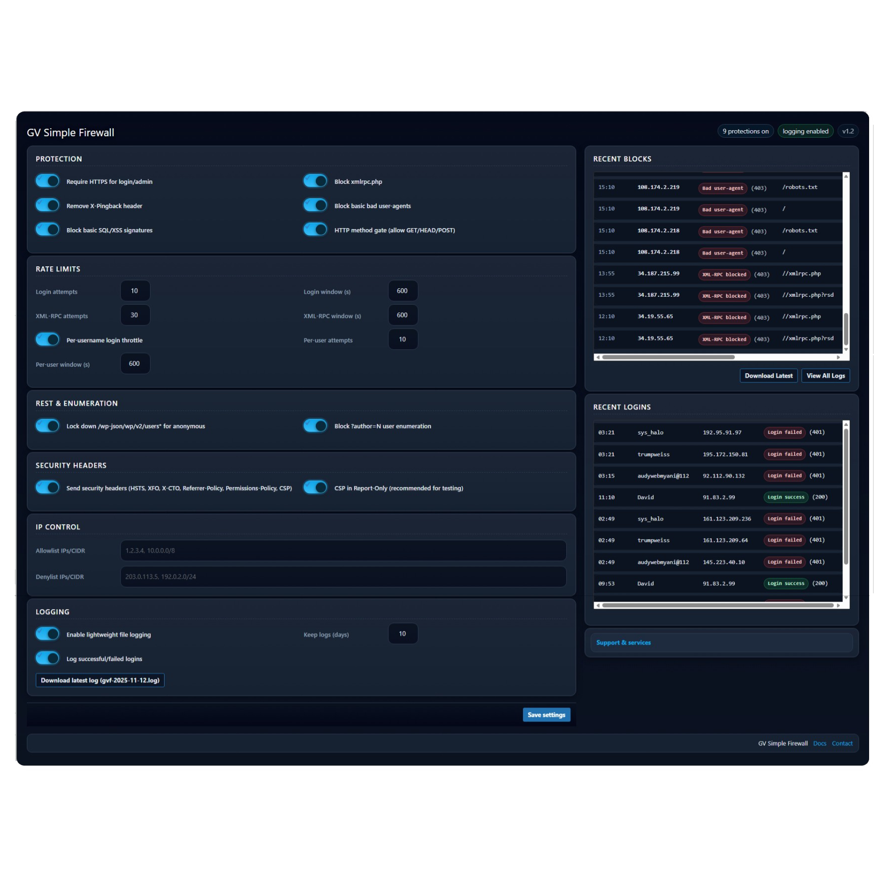

GV-Simple-Firewall

A lightweight, performance-focused firewall providing essential security hardening for WordPress sites.

This plugin is designed to be a simple, "set it and forget it" security baseline that blocks the most common attacks without complex configuration or performance overhead.

#### Screenshots

*The main firewall dashboard, showing settings, recent blocks, and recent logins.*

####Features

Modern Admin UI: A clean, dark-mode-first interface. No more boring settings tables.

NEW - Login Logging: Optionally log all successful and failed login attempts, including the username, to easily monitor access.

NEW - Dashboard Widgets: See Recent Blocks and Recent Logins in real-time directly on the firewall's admin page.

Core Protections: Blocks XML-RPC access, filters common bad user agents, and includes basic signature detection against SQL injection (SQLi) and Cross-Site Scripting (XSS) attempts.

Rate Limiting: Protects against brute-force attacks by limiting login and XML-RPC attempts per IP.

Advanced IP/CIDR Management: Supports IPv4 & IPv6 for Allow/Deny lists. The IP lists are now more flexible, accepting commas, spaces, or newlines as separators.

Smart IP Detection: Accurately identifies visitor IPs, even behind reverse proxies like Cloudflare or Load Balancers.

Secure File Logging: Logs all blocked events to a protected directory within wp-content/uploads, secured with .htaccess and index.html rules.

Optional HTTPS Enforcement: Can force SSL for wp-login.php and the /wp-admin/ area.

####Installation

Download the latest .zip file from the Releases page.

In your WordPress admin, go to Plugins > Add New.

Click Upload Plugin and choose the .zip file you downloaded.

Activate the plugin.

Find the new "GV Firewall" menu item in your WordPress admin sidebar to configure settings.
